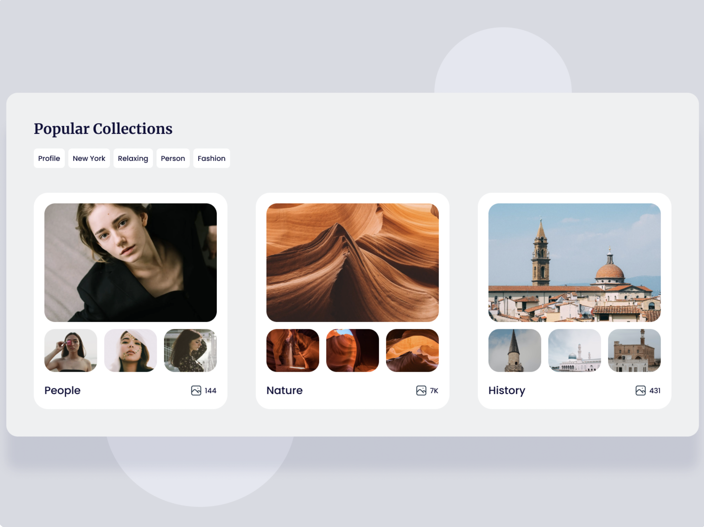
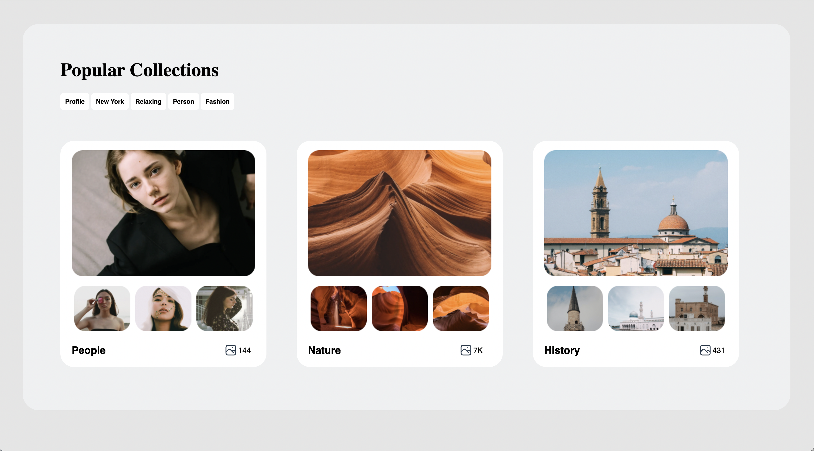

# Project Design

## Projeto criado do zero extraído do site <a href=" https://www.uidesigndaily.com/"> UI Design Daily</a>

### Layout original 👆

- Deploy: [Design Project](https://amandaadev.github.io/design-project/)

### Projeto criado para praticar o desenvolvimento de interfaces web utilizando HTML e CSS, com foco em habilidades de design ao implementar um layout específico fornecido pelo site UI Design Daily.

## Índice

- <a href="#sobre-o-projeto">Sobre o projeto</a>
- <a href="#layout">Layout</a>
- <a href="#tecnologias-utilizadas">Tecnologias utilizadas</a>
- <a href="#desenvolvido-por"> Desenvolvido por</a>

## 📝Sobre o projeto

Este projeto foi desenvolvido por conta própria como parte de uma iniciativa pessoal para aprimorar habilidades em HTML e CSS. Foi inspirado pelo site UI Design Daily, que oferece uma variedade de designs para projetos de desenvolvimento web. Optei por este desafio em específico como uma oportunidade de praticar e aprofundar meu conhecimento nessas tecnologias.

## 💻Layout

### Layout feito por mim 😃

## 🛠Tecnologias utilizadas

## 👩🏽‍💻Desenvolvido por

### `Amanda Hellen`

## 📌Licença

Esse projeto está sob a licença MIT. Veja o arquivo [LICENSE](LICENSE) para mais detalhes.
